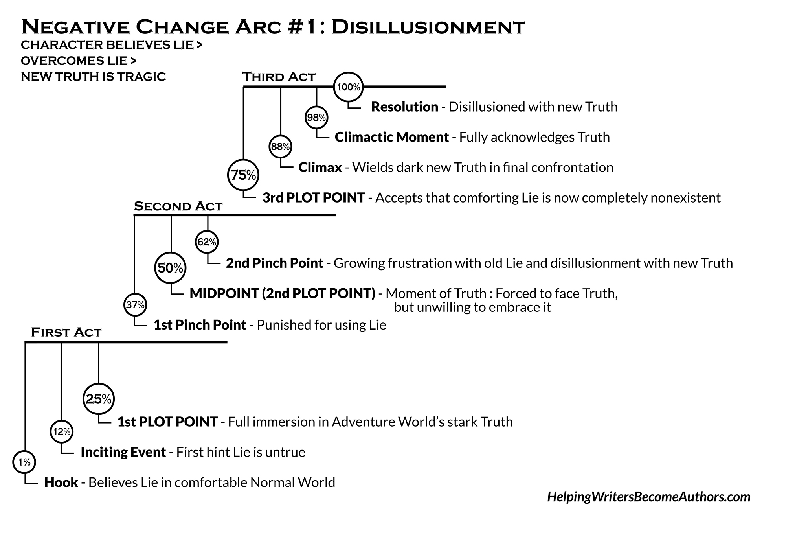
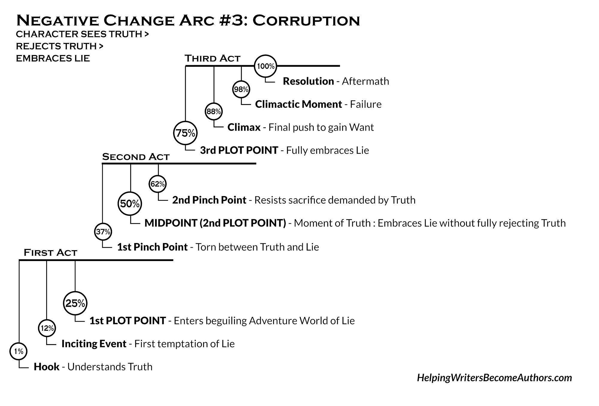
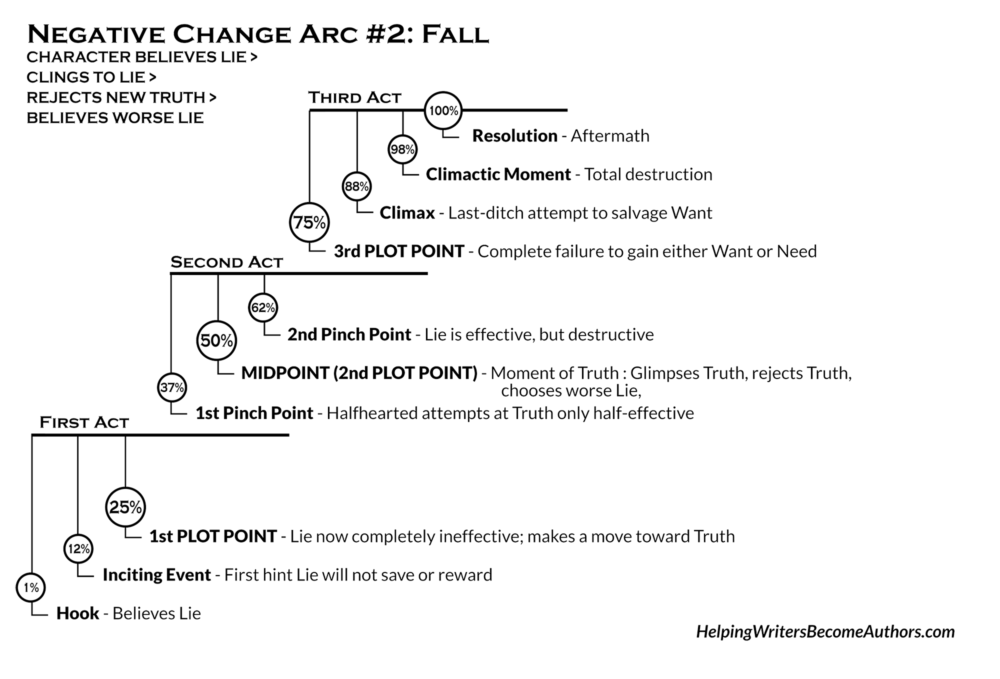

# Templates

[Major character profile](template_major.md)
[Minor character profile](template_minor.md)

# Rag Tag team

Who is the most socially aware? *Yihan*

Who is great with strategic planning? *Yihan*, *Ada*

Who is great with in the moment problem solving? *Ada*

Who is the bravest? *Zaki*, *Ada*

Who is the best fighter? *Vio*

Who brings people together? *Sicili*, *Alan*

# Arcs

## Thematic Truth
The lie the character believes is specifici to their goals/challenges. But the truth ha sto be infinite, with multiple facets. 
The lie should interact with every point in the main conflict and the truth comes in to throw the lie into question.

## Negative arcs

> Character who ultimately believe in the anti-theme.

### Structure
#### Conflicted
graples with their desire, fear, and anti-theme

*What does my character think will make them happy?*
*How is their desire based on their misbelief?*
What makes them subseptable to deception?

#### Fear-base choice
Pushed outside their comfort zone and makes a decision based on their fear and misbelief.

*What is the impossible choice?* How can they still get what they want avoiding their fear or by not changing?

#### Game changer
plot twist, forcing the character to make another decision, one that will change everything

*What unexpected event/cause is going to fuck up their plan/life?*
*Why does it matter to them?*
*How does it change their plan?*

If they are the antagonist, they might cause the twist, then show how does it effect/benefits them.
It can also be significant to them, by showing how far they will go. Point of no return.

#### Acceptance of anti-theme
Accepts anti-theme as their truth, and getting what they want without realizing the truth

*What makes my character embrace the anti-theme once and for all?*
*What dramatic action do they take to get what they want?*

#### Tragic End
After embrace their anti-theme, they realize it does not bring them happiness.

*How can I show my readers that they are to blame for their own tragic end?*

### Disillusionment

Discovers the truth but it is tragic to them. Is truth tragic? Makes them a pessimist.
@Ada

### Corruption

They must be conflicted, doubting their own truth.
@Yule

### Fall

Downward spiral, reject theme at very turn, and cling to anti-theme which leads them to their tragic end. 

### Examples

Loki's fear that he is an outsider and my not be worthy.
Therefore it makes him want to be king of asgard to make him prove himself.
Even after getting what he wants, he is still haunted by his fear.

Show their internal conflict in their first scene.
