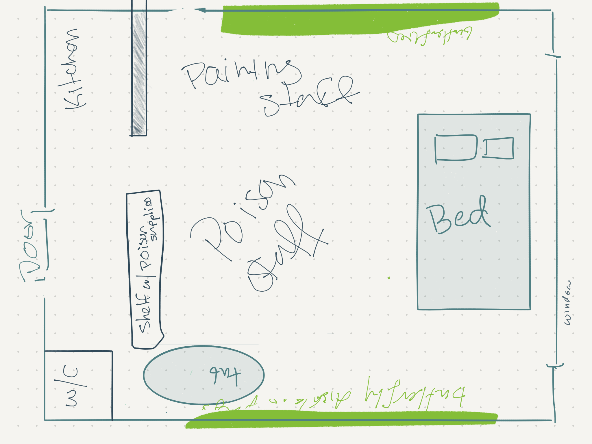

# Zaki Attar

Other names: The Butterfly collector

Birthday: May 5 (Taurus)

Place of Origin: Thoth

Job: (what do they do and how did they get started)
Poison supplier

> How do the draw out the analogy of making a kill to drawing?

---

---
## Goals

> Holding on to anger is like drinking poison and expecting the other person to die

*How are they dissastisfied with their life?*

*What do they think will bring the true happiness?*

*What definitive step could they take to turn their dream into a reality?*

*How has their fear keep them from taking action already?*

*How do they feel they can accomplish their goal while steering clear of the thing they are most afraid of?*

---
## Arc

*What do they believe in?*

*What do the learn in the end?*

*Journey (how they learn about it)?*

---
## Current life

### Daily Routine

---
## People 

### Family
Deceased father and mother

### Friends

---
## Backstory

*What is the best thing that happend in their life?*

*What is the worst thing that happend in their life?*
Watching his parents murdered. *How has that effected their perspective?* Before that his worse fear was worrying that his parents won't let him pursue art as a career. After he saw the world he lived in as no longer safe, and random acts of violence can happen. *What about him his experience seek revenge vs wanting to change the world for others at large?* After the murders, he came out of hiding and threw up. He couldn't bare to stay in the house anymore and ran. In a few days, the police found his DNA samples, and with one of the sons needing cover-up the official report framed him. He saw that in the newspapers. 

*What happened afterwards?*
Afterwards he was on the streets for a year, it was during them that he decided that if given the chance he will seek revenge for his parents murders. He was a pretty decent thief and one day dipped into the pocket of a black market butterfly poison maker. The man caught up to him and recognize his talent for steath. He decided to train Zaki, because he can loan him out as not just another poison maker but also an assassin.

### Learned their lie

*What did they go into the scene believing and how they are surprised by the outcome?*

*How do they struggle to hold on to their old belief?*

*What is their conclusion/new beief?*

---
## Soundtrack

[playlist](https://open.spotify.com/playlist/4O2Jh1jYuiLnI42m9iWi9R?si=QM42877vTYKrA2exBNhsXw)

I want:

Preparation:

Battle:

Reprise:

---

## Reasons

*Motivations*

*Fears*

*What do they value in life?*

*What makes them happy?*

*What gives them hope?*

*What makes them feel alive?*

---

## Perspective

*How do they see themselves?*

*How do they see others?*

*How do others see them?*

*What do they feel about the gov?*
"You'll always be a guest in someone's house" - on POC citizens in a country.

*What do they feel about the church?*

*How do they see the world?*

---
## Battle strategy

*How do they deal with conflict?*

*How do they deal with loss?*

*How do they deal with change?*

 
*What is their method of manipulation?*

---

## Astrology

MBTI:

Ennegram:

## Neurospectrums

---

## Tropes

---