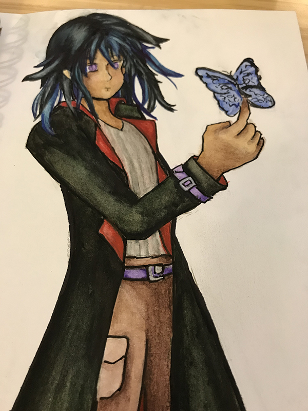
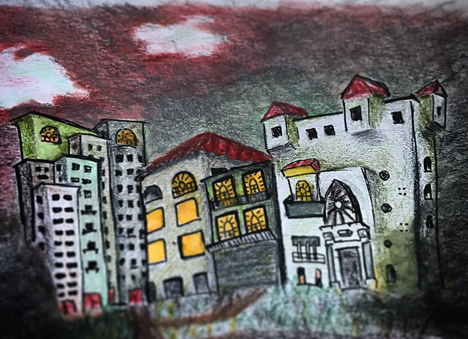
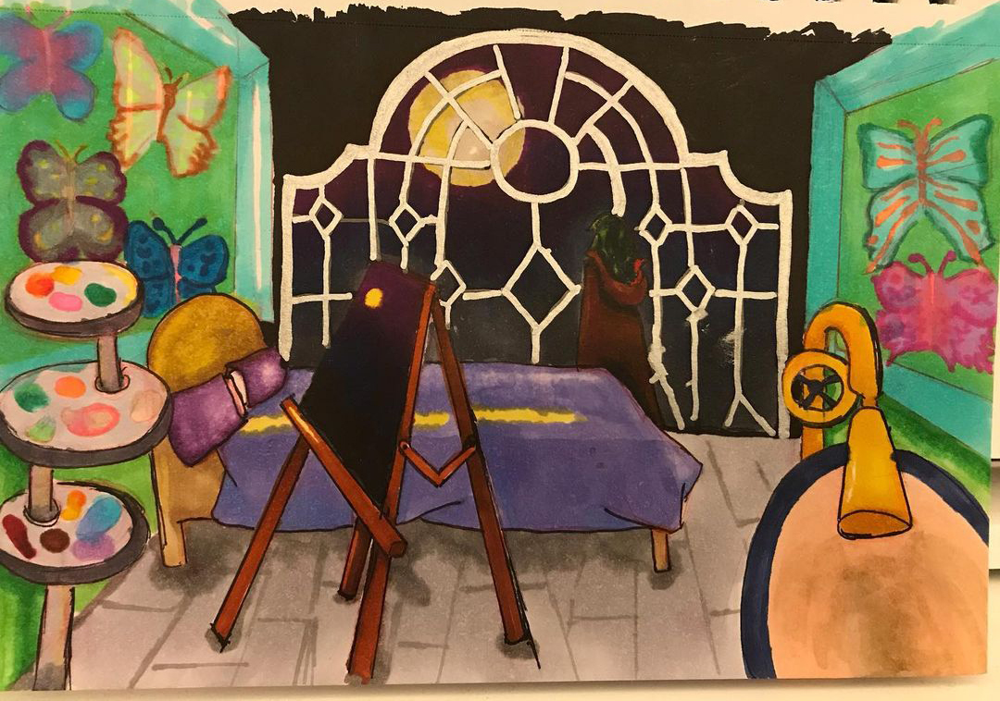

# At Glance

Other names: The Butterfly collector

Birthday: May 5 (Taurus)

Place of Origin: Thoth

Job: (what do they do and how did they get started)
**Poison supplier** - by apprententice with the poison master
**Fighting skills** - on the street, he is very observant, he hung on top of roof tops watching street thugs fight. And he imitated them. One day he spotted an Eastern martial artist practing outside, from him he learned form. *He doesn't use it much nowadays, he mostly work with poisons to weaken his opponents. But he can still hold off on his own if jumped in the streets.*

## Introduction ideas

## Catch Phrase
- What determins something you would say a lot?
- Could be a nervous habit? When do they say it?
- What is an feeling they would express alot? "Cool beans" means 'whatever', so that's apathy.
> 

---
# Theme

## Revenge

When is taking justice in your own hands justifyable?
- secular: when the legal system fails to protect you
- religious: will neeed something along the concept on karma to assure people, that justice will be served. @world/religion

[Psychology of Revenge](https://www.psychologytoday.com/us/blog/tech-support/201707/the-psychology-revenge-and-vengeful-people)

Most people only daydream about seeking revenge and never go into planning or acting upon.
"eye for an eye" - old testament justification.
Jesus was a reformer in encouraging forgiveness.

revenges makes the another suffer, punishment justifies the suffering to prevent future wrong doings.

threat of revenge could have kept people in line to vibe with social codes.

acting on revenge only heighten the relevance of people's traumatic experience even more in their lives.

men tend to derive more pleasure from "getting the bad guys"?

**narcissist** are more likely to seek revenge or those who are **neurotic**. Narcissism is a clearer indicator of people's plan to seek revenge, much more than their ability of forgive. *This makes perfect sense in how he see Sicili, at the end she is just a symbol to his desired life rather than a person.* Inability to manage anger, and obsessive neurotically. 

**Social rejection** increase aggression, by not belonging leads to one's feeling of isolation and takes away their empathy for others. 

[Why It's Secretly Rewarding](https://www.scienceofpeople.com/the-psychology-of-revenge/)

Rush of reward in the moment. But afterwards you feel even worse because you are re-traumatized. Zaki who has felt wronged by so many people, becomes addicted to this feeling. Which is why after his first killing, he goes in for another. **He is chasing that rush**, he felt at the moment.

---
# Goals

> Holding on to anger is like drinking poison and expecting the other person to die

*How are they dissastisfied with their life?*
He feels like "living as guest in someone's house". Since leaving home, he's never felt safe and free living in Galei.
Why didn't he try to flee? Maybe he should but he hadn't thought of it yet. 

Or there can be richness in the flashback if he really was ready to leave Galei, but he sees the man.

*What do they think will bring the true happiness?*
They think revenge can make them feel safe and welcomed again. How can we make that thought make sense in Zaki's mind?

Or let's work backwards. 
- *What makes him think being with Sicili will bring him happiness?* He first time he meet her she had finished cooking dinner, and offered him some. It could be a dish his family cooked.
- *How do we tie that back to his desire for revenge* You want revenge because you believe they have wronged in, and want to make those who has done it give you what they initialy denied you.
- *What had the boys denied Zaki of?* A sense of security. So to bring that back around, he sees in Sicili as a sense of home.
- *What if he was ready to give up on the plan, but Sicili's rejection turned his attention back to revenge?* We'll need a scene to show that.

*What definitive step could they take to turn their dream into a reality?*
Kill those people and expose the crime they had committed. He made each of them confess to a tape recorder, when he killed them. 

*How has their fear keep them from taking action already?*
N/A they already took action.

*How do they feel they can accomplish their goal while steering clear of the thing they are most afraid of?*
He believe revenge will make him feel safe, but their deaths still haunt him.

---
# Arc

## Anti Hero

What is the ah-ha moment the anti-hero has more of a conscience than they thought? *Yule had that moment when he refused to use the people in Varin's church as bait in order to escape wit the painting.*

NAIL THEIR INTERNAL CONFLICT!

Not just setup to make bad decision. This is a character who has been making lots of bad decisions throughout their life. And they should have a very good reason to be morally flexible. **Why?**

You make your reader look really hard for something good in this character.

Let them be their own worse enemy. 

## Needs
Vio to break him out of his narrative life story. *A huge gist of writing their arcs is figuring out how they need eachother to grow. That is much more a compelling way to show their attraction than any romance or sexual tension.*

Journey: Forgiveness, Letting go of ideas. Letting go ~ maybe Zaki's journey is one of grief

Story: Zaki wants to get close to Edgar to kill him and the rest of the council. Zaki hell bent on revenge, starts to lighten up with the influence of the sisters. When Sicili finds out he's been stalking her, she tells him to stay away. Instead of letting go, he holds on tighter, believing that to win the Alighieri's sisters back, he has to win the war, and bring the peace they have long for seeked. He believes only in acquiring power, will he be loved.

## Misbelief
- Revenge will bring you happiness
- Being victorious makes you worthy of love

*What if Zaki's serial kills are not about personal vendetta but killing those who have harmed Sicili?* It will tie his two plot threads tighter together. But now how do we tie that into the revenge theme?

## Fall Arc

`TODO 9-pt plot is much more exciting than Abbie's... but we may no have enough pre-planned plot points for Zaki. Can we squeeze more in or just have a few more things happen after he kill Edgar.` Does he get caught, does the step forward? How will the country handle him?

[The better fall structure](https://www.helpingwritersbecomeauthors.com/learn-5-types-of-character-arc-at-a-glance-the-3-negative-arcs-part-2-of-2/)

(Act 1)
### Hook
Believes in lie but is also *conflicted*.
*What does my character think will make them happy?*
*How is their desire based on their misbelief?*

### Inciting Incident
Lie my not bring you happiness

### Fear-base choice (battle 1)
Pushed outside their comfort zone, when his world view gets challenged.

*How can they still get what he still find happiness, without changing his perspective?*

Does he lean closer to the theme? **What if working for the Atonian councilman, was his plan to get closer to Edgar. But his rejection of finishing the job cost him his chances.** But he decides it's okay, he may have another path to get to Edgar. And even contemplates letting of completing his revenge, (influcned by Vio) and living happily with Sicili. 

(Act 2)

### Game changer
midpoint plot twist. They make a decision that will change everything.

**SOMETHING HAPPENS! Edgar threatens Sicili, and he decides she can never be safe if he doesn't kill Edgar. It doesn't have to be direct, he could pass a policy that threatens her.** Maybe it's all undocumented people will be shipped out. Sicili casually mentions she'll never feel safe with Edgar as PM. He tells her "don't worry, I'll keep you safe."

*What unexpected event/cause is going to fuck up their plan/life?*
*Why does it matter to them?*
*How does it change their plan?*

### Battle 2
anti-theme is effective, but destructive

### Darkest Hour
Or brightest hour, when Zaki thinks he can be happy.

(act 3)
### Battle 3 (Acceptance of anti-theme)
Fails to get want/need
He kills Edgar, and Sicili doesn't want to be with him.

Accepts anti-theme as their truth, and getting what they want without realizing the truth

*What makes my character embrace the anti-theme once and for all?*
*What dramatic action do they take to get what they want?*

### Climax
manic attempt to salvage want

### Total destruction
Does he fall apart?

### Tragic End
After embrace their anti-theme, they realize it does not bring them happiness.

*How can I show my readers that they are to blame for their own tragic end?*

---
# Current life

Living as a poison maker and administer. He like Vio works the night shift, even though he is out on a kill less often. He uses the night to prepare the poisons on the nights he's home.

## Daily Routine
12am (midnight) - start work (either preparing poisons or out on assignment)
4am - washes up and paints for awhile
6am - goes out to collect butterflies
10am - comes home to sleep
4pm - gets up to start day
makes breakfast
paints for a while

---
# People 

Answer:
1. How do they see this character?
2. How does this character see them?
3. What archetypes does their role in the story play?
4. What is the progression of this relationship?

## Family
Deceased father and mother. They are refugee scholars, who lived in a small town. They got murdered by their neighbors. They never talked about how they got displaced by the Order. They focused on starting a new life in Galei.

## Friends

`TODO answer`
*How can we spin it where his sporadic lashing out can be viewed as passion in the romantic tropes and a huge reflag to those who are abuse informed?*

`TODO does he have an insightful senstive friend? Does he have a Max? Vio? Yihan?`

### Vio
![[r.vio_zaki]]

### Yule
they have worked togther several times. Their relationship is a bit of the hero v anti-hero archtype.

He sees **Yule** as someone in the way of being with Zaki.
*How does the Zaki/Sicili/Yule dynamic play out?* Is Zaki aware of Yule and Sicili's budding relationship?

### Sicili
He see **Sicili** as the partner he deserves after achieving his goal. She presents the image of what a wife should be, and projects goodness upon her that she doesn't really have.

**Sicili** has never had a lover before. While she doesn't like Zaki, and ultimately thinks he's beneath her. Why would she think that? Because she was raised to see her marriage as a political advantage, and even though she is no longer in that role. The idea of how she sees the value of her own *hand* still has not changed.

## Employment

### Edgar
He sees **Edgar** as the ultimate goal to exact justice for the injustice done upon his parents. Even when Edgar shows him kindness.

**Edgar** or more percisely how the the council see him? They know who he is, why do they not arrest him? Do they know he's killing people from prominent families? ~~What if they do, and just lets it happen anyway because they want to use him to be the new figure head of the nation.~~
If they didn't know, why would they hire him? When did Edgar die? Sometime after Jacques pulled the org out. So his relationship with Edgar is just his relationship with the council, and since one of the councilmen hired him to kill the Aligheiri... does the councilman know it's Zaki?
Yes: He'll be keeping Zaki under his watch by hiring him as Edgar. 
No: Who are the council that are decided to hire Zaki? `TODO revisit after Edgar's profile`

---
# Backstory

*What is the best thing that happend in their life?*
Vio rescuing him from the fire. Meeting Sicili?

*What is the worst thing that happend in their life?*
Watching his parents murdered. *How has that effected their perspective?* Before that his worse fear was worrying that his parents won't let him pursue art as a career. After he saw the world he lived in as no longer safe, and random acts of violence can happen. *What about him his experience seek revenge vs wanting to change the world for others at large?* After the murders, he came out of hiding and threw up. He couldn't bare to stay in the house anymore and ran. In a few days, the police found his DNA samples, and with one of the sons needing cover-up the official report framed him. He saw that in the newspapers. 

*What happened afterwards?*
Afterwards he was on the streets for a year, it was during them that he decided that if given the chance he will seek revenge for his parents murders. He was a pretty decent thief and one day dipped into the pocket of a black market butterfly poison maker. The man caught up to him and recognize his talent for steath. He decided to train Zaki, because he can loan him out as not just another poison maker but also an assassin.

## Learned their lie

*What did they go into the scene believing and how they are surprised by the outcome?*

*How do they struggle to hold on to their old belief?*

*What is their conclusion/new beief?*

---
# Soundtrack

[playlist](https://open.spotify.com/playlist/4O2Jh1jYuiLnI42m9iWi9R?si=QM42877vTYKrA2exBNhsXw)

I want: [You Want a Battle - Bullet for My Valentine](https://open.spotify.com/track/1KCAEG6JcsTzi8ddZzs0nk?si=064y4E1VTsivYYBvQao1bQ)

[She will be loved - Maroon 5](https://open.spotify.com/track/6QsPYWmHEUEvfFiOJRcQQA?si=PvNaJoqHRWymtGWEshd3cg)

Preparation: [Seven Devils - Florence & the Machine](https://open.spotify.com/track/5qaLfqAUiqvsoL0l4T05Yx?si=VIOyA6MrTOS0sOQG1XB0mg)

Battle: [Rebirthing (instrumental) - Skillet](https://open.spotify.com/track/39Y30lgmHLxBWaSknRDII7?si=s2Qj_K2ESbKZKTyRyjFUMg)

Reprise: [It's your fault - Phil Zhang](https://open.spotify.com/track/7JahVFmZWC4hWR9Agmohyz?si=XvUDfk27SiS84nM_9fHqYw)

---

# Reasons

## Motivations

- Revenge. seekers can be narcasist, feels they have been wronged and plan to seek justice for it. they struggle with emotional regulation.

## Fears

- *What are his fears pre-murders?* Parents will not let him pursue an art career. **Fear of not having agency over your career path**
- *After running away?* Afraid he may not be able to survive on his own.
- *After being framed?* Afraid of being caught. **Afraid to live in Galei, but has no means of leaving.**
- *Before meeting the poison master?* He had toughen up during the years on the streets. He is no longer afraid of the previous things he's afraid of. Now he has alot of confidence in himself. `This could be a spin-off, how Zaki learned to overcome his fears and survive on the streets.`
- **After living with the poison master?** Was the poison master abusive? No, we've tortured him enough. **He did develop the fear of abandonment** because whenever he messed up the poison master muttered about getting another apprentice. He still holds his fear, even after he's no longer dependent on the poison master. And shows it with the sisters?
- *At the start of the story?* Fear of feeling the grief from living in an unjust world? Fear of being caught?
- Developed during the story?

*What do they value in life?*
a beacon, like Sicili .. but why? does everything draw back to the night his parents got killed?

Maybe behind wanting a beacon, he more so wants something to believe in? But why?

why do people believe? maybe it's like the boundless birds problem, knowing the futility of life is too depressing. That we must construct a lie for ourselves to keep us going. I guess this can be something Vio and Zaki bound over in this chapter. 

What is Zaki conscious of that he wants? What did Phil want in life? To believe he can, that despite living in the shadows for many years. He wants to prove to himself that he can have a normal life, a girl friend, a job, and that it won't be all taken away in the blink of an eye. Which is how he feels about being Hastuit in Galei. He saw his parents try to fit into Galeian society, just when they thought they could become part of the culture of the country it was all suddenly taken away.

## Feels Happy
Painting

## gives them hope Sicili

# Feels alive when
@vio because they get put into alot of near death situations together. He associates her with that rush. 
Their pattern is rush, rush, peace. Where for two chapters they have exciting adventures together, they have one bonding chapter.

---

# Perspective

What are the precautions of homeschoolig kids? Is that similar to a cancer survivor?

*How do they see themselves?*
Zaki see himself as the center of this world. And view all things as how it ultimately affects him. His parent's murder was bad because it put his life at risk. 

*How do they see others?*
He sees other as a means to achieve the life he wants. He thinks everyone is just looking out for themselves and will cheat/hurt others to get what they need. For that he keeps mostly to himself.

*How do others see them?*
The is normally viewed as secretive, since he spent most of his life hiding. Most people don't catch on to his narcissitic tendencies, except Yule, who by working for a egomaniac caught on. Yihan, who is most socially ept notices too, but I'm not sure if they ever had much interaction together.

*How does Zaki think of a punative justice system vs a restorative one?*
Like Light he is for a punative justice system as long as it actually is just. He understands that a punative justice system that is not fair for all people, is itself a means of oppression.
What about restorative justice? It has never crossed his mind, it is the sisters, who has brought the idea to him. How did he react to it? At first he dismisses it for being impractical. It will take too long to rehabilitate, and seeing the cruelty of people as a young child, he believes that some people are just bad and unredeemable. Therefore setting on the conclusion that ultimately it will fail because you can't fix people. Bad people should be immediately disposed of as to not drain a toll on society. Keeping them in jail is just a waste of state resources.

*What do they feel about the gov?*
"You'll always be a guest in someone's house" - on POC citizens in a country.

*What do they feel about the church?*
N/A He was raised under a different religion. Even though it was the Order that made his parents refugees, he was born in Galei and does not hold any meaningful resentment towards them. His parents didn't either, they let the cause of their displacement go and tried their best to focus on starting a new life in Galei.

*How do they see the world?*
Sees things in black and white. He sees people as symbols, and ultimately believes that people are more often bad than good. 

---
# Battle strategy

*How do they deal with conflict?*
Retreat, and them come back when he has a plan.
Unlike Alan he doesn't rush into action, but he also doesn't shy away from a fight. 

*How do they deal with loss?*
How did he cope with his parents death? Did he ever have space, when immediately after he was worried about survival?

*How do they deal with change?*
He is pretty adaptive, after all he learned to live on the streets and get taken up by the poison master.

*What is their method of manipulation?*
Acts of kindness, or helping out. After meeting Sicili, he is always willing to offer help to Vio. To get close to Edgar, he takes on more government secret jobs.
He has learned this through his relationship with the poison master.

## What is the cost of their power?

---

# Astrology

MBTI: INFJ (Advocate)

Ennegram: 4 - Individualist

## Neurospectrums
Borderline and narcissist. He is in a toxic relationship with himself. The narcacistic tendencies are a cover-up for the insecurities felt by his borderline insecurities. 
Have poor insight over how his behaviors are detrimental to himself. 

---
# Inspiration

## Tropes

[GentlemanThief](https://tvtropes.org/pmwiki/pmwiki.php/Main/GentlemanThief)

> Steadfast code of ethics, that he applies not only to himself but everyone arounds him

[Determinator](https://tvtropes.org/pmwiki/pmwiki.php/Main/Determinator)

> Single minded blent on revenge

---

Zaki pulls qualities from Philip and Ryan. What would that look like?

What are the qualities that we draw from Phil? His talent at drawing. His overaching gestures. His idealization...

Thinks like Phil but acts like Ryan. At the core, he thinks and feels very deeply about everything. But he's learned that the world is not hospitable to a boy like him. So he often acts out, often impulsively. 
